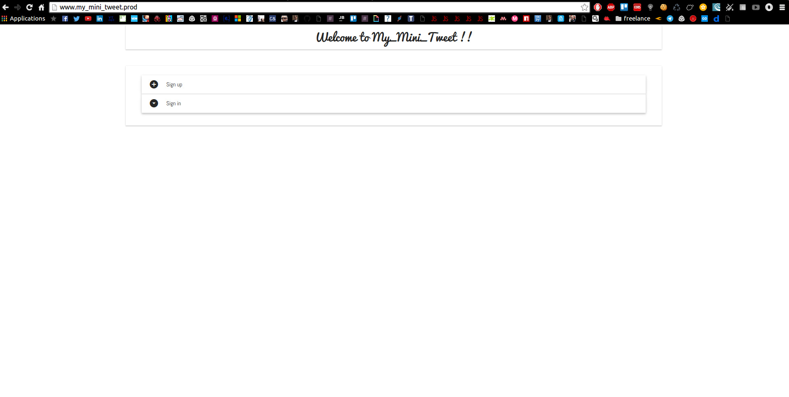
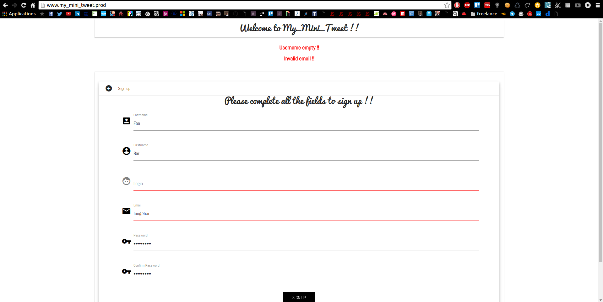
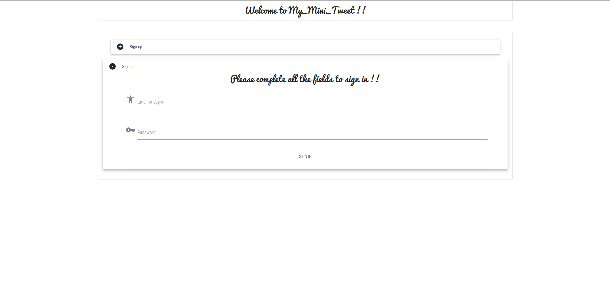
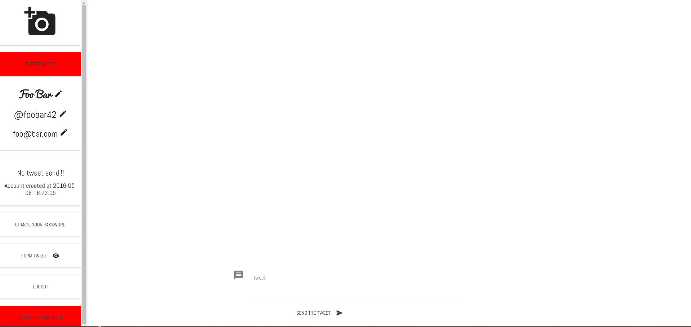
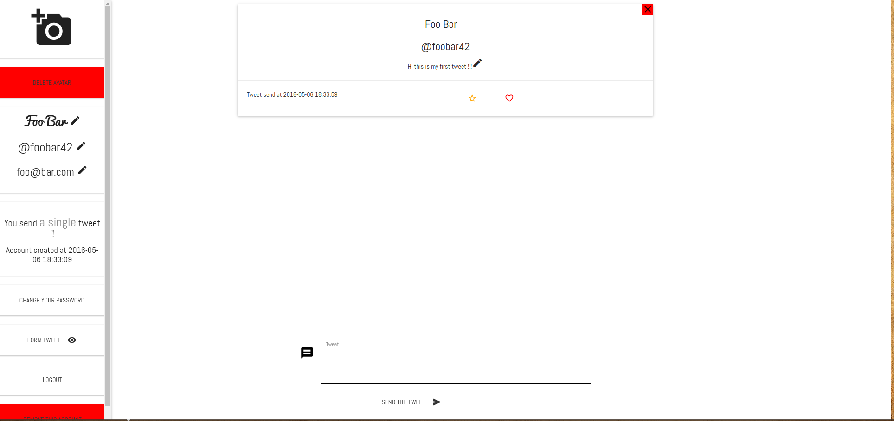
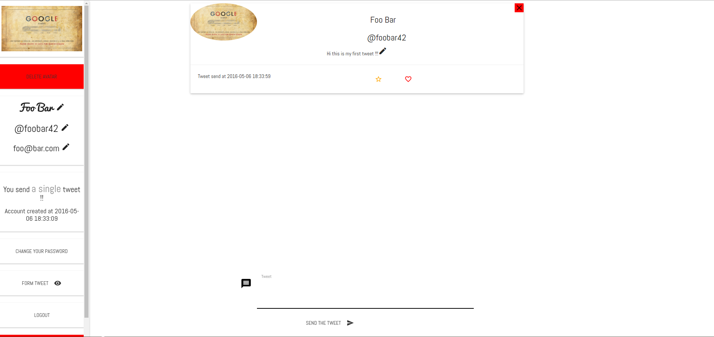
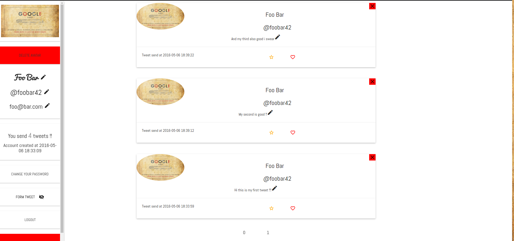
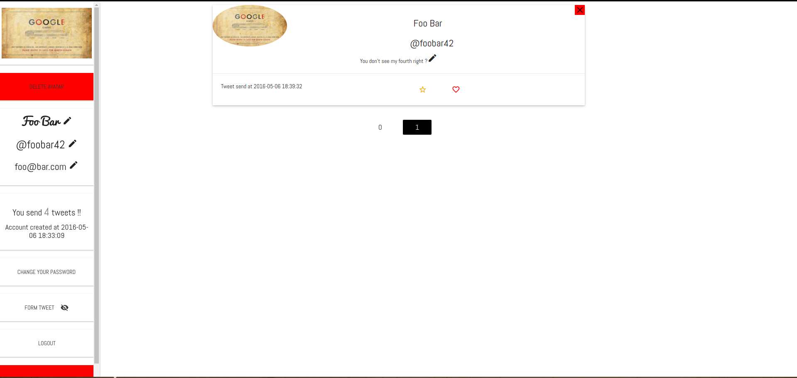

# My_Mini_Tweet
##My_Mini_Tweet is a good way to test your own ego !!
####You need to have PHP5.6+ 
#####Test this project in a LAMP stack please !! 

Plugins and libraries :  
---------------------
* [muicss](https://www.muicss.com/)
* [materialize](http://materializecss.com/)
* [google material icons](https://design.google.com/icons/)
* [jQuery](https://jquery.com/)

------------------------------------------------------------  

Warning : 
---------

First you need to grant some write and read acces to this project : 
```sudo chmod -R 0777 path/to/My_Mini_Tweet```

------------------------------------------------------------  

(Optional) You can change the my_mini_tweet.prod.conf like this :  
```
DocumentRoot path/to/project/
<Directory path/to/project/>
```

After that you can put the .conf file in your apache directory (/etc/apache2/sites-availables) and :  
```
sudo a2ensite display.prod.conf
sudo service apache2 reload
```

If you are want to test the project, go to your /etc/hosts file and :
```127.0.0.1	www.my_mini_tweet.prod```
  
After that you can go to your favorite web navigator and write :


    http://www.my_mini_tweet.prod/

------------------------------------------------------------  

How to use :

/!\ If you want to use it directly with fulled exemple, just connect with login = isma91 and password = campus /!\  

I assume you enable the conf file in your apache directory !  

Before starting, don't forget to import the my_mini_tweet.sql file in your database !!  

So we go in http://www.my_mini_tweet.prod/ and we see this :
  

As you can see you can sign up or sign in, let's create a user !!
  

We can see that we forgot the login and our email adresse is invalid... We write in login foobar42, email foo@bar.com and password as testtest and we click in Sign Up !!
Tops: if you forget the pass you wrtied, just hold the click on the eye in his right and you can see your password !!
  

The sign in part display automatically !! We can now add our created user foobar42 or foo@bar.com and the password testtest.
  

Ok here is our wall, in the lest there is your avatar ( empty ), your lastname and firstname, your login, email, how many tweet you send and when you create your account  
We also notice that we can change all this if we click in the pen in their right...  
The form tweet button is to display/hide the tweet form in the center bottom of the screen, we the eyes is open, the form is here and when the eye is crossed, the form is hidden !!  
You can also logout and remove your account, but you need to write your password to validate this kind of dangerous action... Let's send a tweet !!
You can't send more than 120 characters by tweet !! Don't forget that !!

  

Yay !! Our first tweet is here !! As you can see you can remove, change the content, favorite him or like him !! But first, let's add an avatar...Just click in the photo in the top left.  

  

Ok we finally have an avatar !! And our tweet add the avatar automatically !! That's great !! Let's add several tweet, like 3 more tweet !!  

  

I hide the tweet form to display all the tweet in the screen !! But wait, the fourth tweet is in the last page because we paginate the tweets !! Every 3 tweets, we add a page display properly !!  

  

Ok so you know how to create a tweet, how to sign up and in, you can also edit all your personnal info wy clicking in the button or in the pen...
Thank you to using this project !!